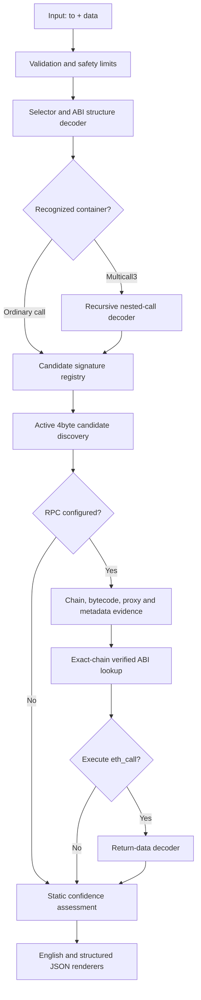

# Rehum — System Design

## 1. Purpose

The system converts two user inputs—an EVM target address (`to`) and calldata (`data`)—into:

1. a deterministic structural decode;
2. a plain-English explanation of the requested behavior;
3. an evidence trail showing how each interpretation was established;
4. an explicit confidence level when human-readable semantics cannot be proven.

The default operation is local and read-only. Network enrichment and `eth_call` execution are optional and configured separately.

## 2. Product contract

### Required request fields

```json
{
  "to": "0x...40 hexadecimal characters...",
  "data": "0x...even-length hexadecimal calldata..."
}
```

### Configured context

```json
{
  "rpc_url": "https://...",
  "block_tag": "latest",
  "execute": false,
  "sourcify": true,
  "max_calls": 4096,
  "max_payload_bytes": 4194304
}
```

The RPC URL determines the network. An address and calldata alone do not identify a chain.

## 3. Architecture



## 4. Component responsibilities

### ABI primitives

`abi.py` owns byte validation, 32-byte word access, address extraction, static argument decoding, string-result decoding, and block-tag validation. It contains no network or presentation logic.

### Recursive decoder

`decoder.py` identifies selectors, filters structurally compatible candidates, decodes Multicall3 `aggregate3`, and enforces nesting, payload, and call-count limits.

### Function registry

`registry.py` is an auditable local knowledge base. Multiple candidates may coexist for the same selector; registration does not imply certainty.

### Active signature discovery

`signature_lookup.py` queries Sourcify's 4byte service for unknown or merely likely selectors, rejects malformed signatures, recomputes every selector locally, decodes each candidate against the actual arguments, and retains collisions as alternatives. These results can establish `LIKELY` or `AMBIGUOUS`, never `CONFIRMED`.

### Ethereum hashing

`keccak.py` implements dependency-free legacy Keccak-256. It is used to reproduce selectors from canonical ABI signatures and is checked against Ethereum test vectors during preflight.

### Verified ABI provider

`verified_abi.py` retrieves exact-chain ABI evidence from Sourcify API v2, constructs canonical tuple signatures, computes selectors, and upgrades a matching interpretation to `CONFIRMED`.

### RPC evidence resolver

`rpc.py` identifies the chain, verifies deployed runtime code, resolves EIP-1167 and EIP-1967 proxies, probes token metadata, applies verified implementation ABIs, optionally executes the original `eth_call`, and attaches supported return values.

### Renderers

`render.py` keeps presentation separate from decoding. English output describes intent, while JSON preserves addresses, selectors, raw data, evidence, confidence, alternatives, children, and results.

### Preflight gate

`preflight.py` verifies the runtime, Ethereum hash vectors, registry integrity, decoder behavior, configuration schema, RPC connectivity, Multicall3 deployment code, and optional Sourcify connectivity.

## 5. Evidence and certainty model

Evidence is evaluated from strongest to weakest:

1. verified ABI for the exact chain and deployed implementation;
2. resolved proxy implementation with a verified ABI;
3. standard interface plus matching layout and behavioral probes;
4. local or public selector candidate plus compatible ABI layout;
5. unrecognized selector with raw ABI words only.

Confidence values:

| Level | Meaning |
|---|---|
| `CONFIRMED` | Authoritative ABI/address evidence establishes the signature, or a canonical deployment and exact structure establish a known container. |
| `STANDARD` | Selector and layout match a standard such as ERC-20, but the target's authoritative ABI has not yet confirmed it. |
| `LIKELY` | A compatible candidate exists, without authoritative target-specific evidence. |
| `AMBIGUOUS` | Multiple compatible interpretations remain. |
| `UNKNOWN` | No compatible interpretation is available. |

Runtime behavior can corroborate parameter and return shapes, but it cannot recover a function's original source-level name when that name is absent from bytecode.

## 6. Read-only semantics

The tool explains both the requested function and its RPC envelope:

- `eth_call` does not persist state changes.
- Calldata may still represent a state-changing function such as `transfer` or `approve`; in that case the tool says it is being simulated.
- A user must not infer that calldata is safe to submit as a transaction merely because an `eth_call` simulation is read-only.

## 7. Security boundaries

### Untrusted calldata

- Maximum input size defaults to 4 MiB.
- Recursive nesting defaults to 12 levels.
- Multicall batches default to 4,096 items.
- Dynamic offsets must be aligned, in bounds, and outside their array/tuple heads.
- Addresses require exactly 20 bytes after ABI padding is removed.

### Untrusted network responses

- RPC URLs must use absolute HTTP(S) URLs.
- RPC and Sourcify responses are capped at 16 MiB.
- Network timeouts are bounded.
- RPC errors become evidence warnings rather than silently changing the static interpretation.
- Private RPC URLs are never included in normal rendered output.

### Evidence integrity

- Public selector databases should only create `LIKELY` candidates.
- A verified ABI must be scoped to the identified chain and resolved implementation.
- Selector hashes are recomputed locally from canonical signatures.
- Conflicting verified candidates remain `AMBIGUOUS`.

## 8. Extension interfaces

The next supported decoders should be implemented as bounded container/interface modules rather than renderer special cases:

- Multicall2 and additional Multicall3 methods;
- Safe multisend;
- ERC-4337 user operations;
- common DEX routers and universal routers;
- account-abstraction execution batches;
- event and log decoding;
- trace-based internal-call explanation.

Each extension must provide fixtures, malformed-input tests, English-output assertions, and evidence rules.

## 9. Release gates

A build is implementation-ready only when:

1. all unit tests pass;
2. local preflight contains zero failures;
3. connected deployments pass `--require-rpc` preflight;
4. the configured chain is reported explicitly;
5. unknown and ambiguous calls remain labeled as such;
6. no RPC credential appears in logs or output;
7. representative malformed calldata is rejected within configured resource limits.
